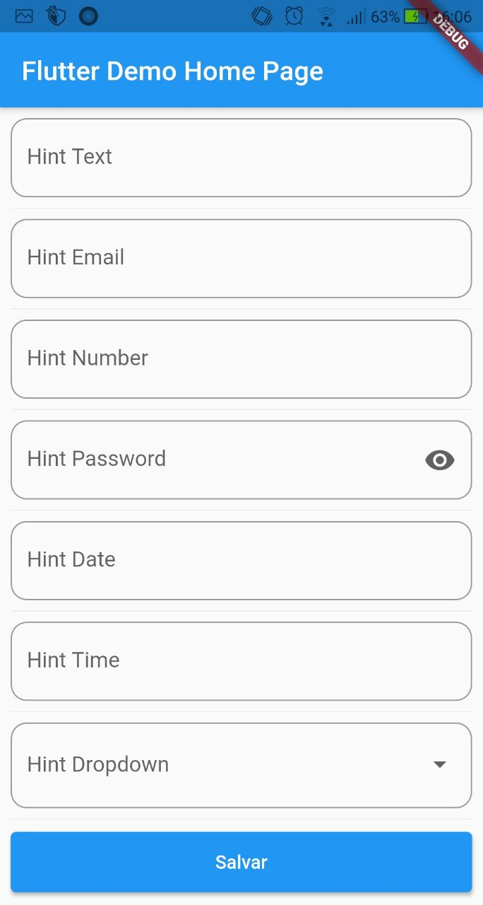
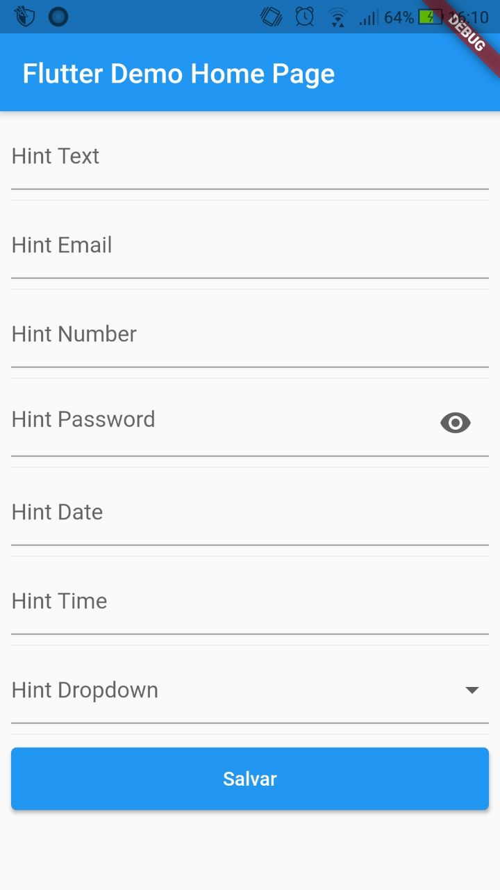

# Form generator

Yet to receive the proper documentation.
This package generates a Form, basead on the fields it receives, it's purpose is to be the most intuitive and simple way to make straight forward fomularies, in less than a week (launched at 2021-04-26) it will receive a proper documentation, until that, please check the example file witch already contains the most important information about it.
  <b>Thanks for use :-)</b>

| Preview w/ custom decoration | Preview wo/ custom decoration |
|---------|---------|
| | |
## Getting Started

This project is a starting point for a Dart
[package](https://flutter.dev/developing-packages/),
a library module containing code that can be shared easily across
multiple Flutter or Dart projects.

For help getting started with Flutter, view our 
[online documentation](https://flutter.dev/docs), which offers tutorials, 
samples, guidance on mobile development, and a full API reference.
